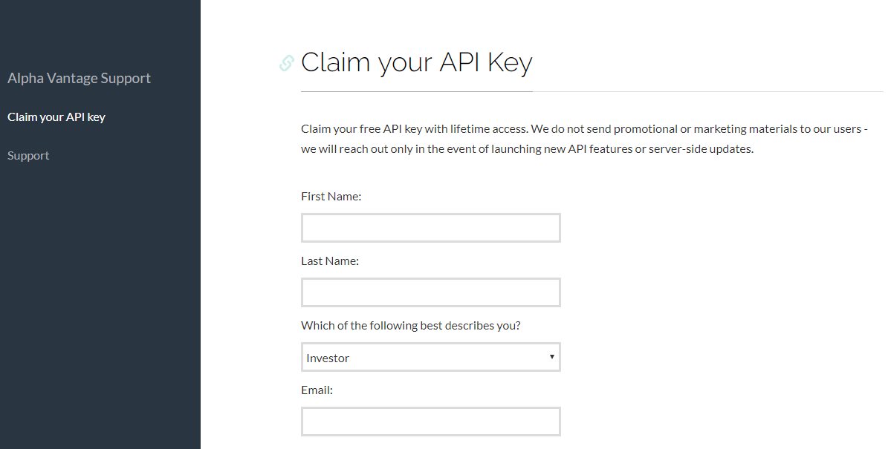
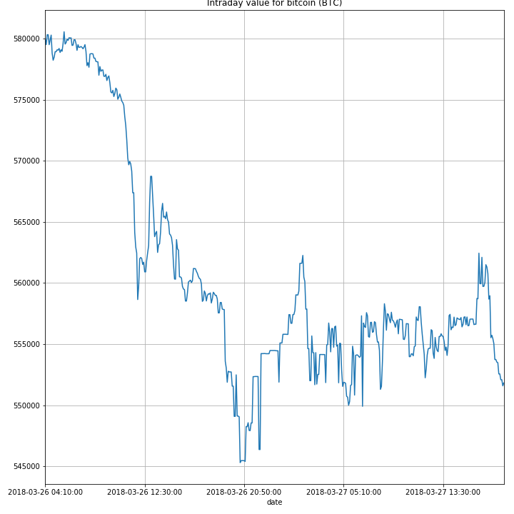
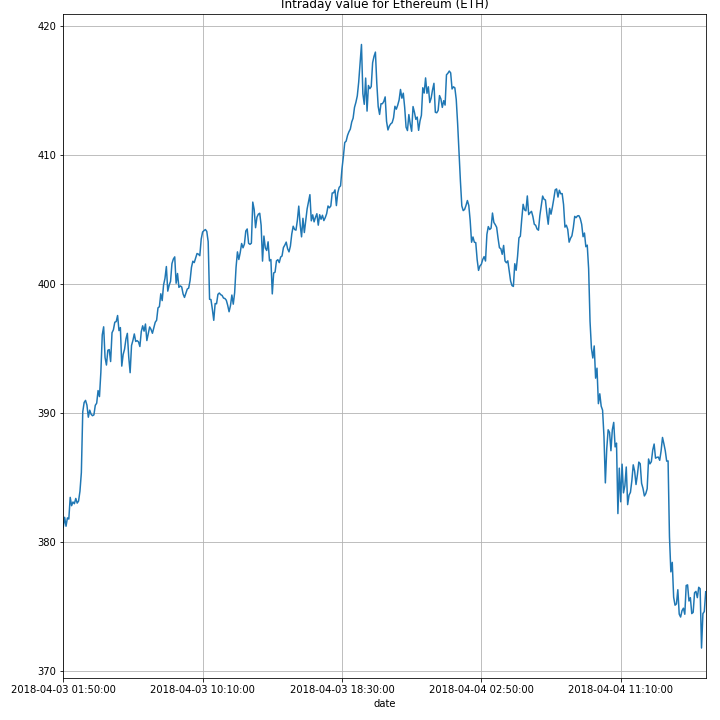

# Intraday Values of Cryptocurrencies in different markets

Authors:  **Priyesh Jain** and **Pranav Kulkarni**

---

## Introduction
- Cryptocurrency is a digital currency that uses encryption technology (Cryptography) to generate units, secure and verify transactions. In technical terms, it’s an encrypted, peer- to- peer virtual currency comprising of codes and it’s similar like any other medium of exchange such as USD, GBR and EUR but in this aspect, the exchanges make use of encrypted details and exchange of digital tokens in a distributed and decentralized manner and these tokens can be traded at market rates for flat currencies.

- The type of data that we are going to import is the intraday digital cryptocurrencies (for example Bitcoin). The API we used in this project, returns the realtime intraday time series (in 5-minute intervals) for any digital currency (e.g., BTC/Bitcoin) traded on a specific market (e.g., CNY/Chinese Yuan). Prices and volumes are quoted in both the market-specific currency and USD.

## Why this dataset? 
- Until the invention of Cryptocurrency, it was impossible for two parties to transact electronically without employing the service of a third party or a trusted intermediary.
- There are currently more than 700 cryptocurrencies in circulation with a total market capital of over $300 Billion.[1]
- The data used for this project is real-time and gets updated in every 5 minutes of interval daily, hence called Intraday.

---

## Data Source
- Alpha Vantage portal delivers a free API for real time currency data and highly used finance indicators in a simple Json(JavaScript Object Notation) or pandas format.


- This process requires a free API, that can be requested on http://www.alphavantage.co/support/#api-key
- They have the API call functions available in their documentation http://www.alphavantage.co/documentation
- The xml data can be imported in the json script format through this link: https://www.alphavantage.co/query?function=DIGITAL_CURRENCY_INTRADAY&symbol=BTC&market=INR&apikey=TX579SIO12GQQ3K4

---

## Explanation of the Code
For demonstration purposes, we'll be using the Cryptocurrency Bitcoin (BTC) and its price in the Indian Market (INR). 
From the source Alpha Vantage, we can use the python script in 2 formats for this project: either Pandas or JSON. For JSON format, we have to copy the url link in the function while in Pandas output format, we just need to call the API function. 

First we need to install the alpha vantage package and simple json through the command prompt.
```
pip install alpha_vantage 
```

```
pip install simplejson
```

The code, `CryptoAPIProject.py`, begins by importing necessary Alpha Vantage Python packages:
```
from alpha_vantage.cryptocurrencies import CryptoCurrencies
```
Importing the pprint module. The ‘pprint’ command is used to print(display) the data in an aesthetically better manner.
```
from pprint import pprint
```
Now, the library supports giving its results as json dictionaries (default), pandas dataframe or csv, we can simply pass the parameter output_format= 'pandas' to change the format of the output for all the api calls in the given class. The pandas data frame given by the call, can have either a date string indexing or an integer indexing (by default the indexing is 'date'), depending on our needs, we can use both.

Now, we create a function 'Cryp' in which the Cryptocurrency and the API Key will be stored in the output format of pandas. And, then to fetch the data, we created another function called Data in which we are going to store the cryptocurrency type and the market.  
```
Cryp = CryptoCurrencies(key='YOUR_API_KEY', output_format='pandas')

Data, meta_data = Cryp.get_digital_currency_intraday(symbol='BTC', market='INR')

pprint(Data.head(2))
```
Data.head(2) represents 2 row entries of 2 different time intervals. The pprint module provides a capability to “pretty-print” arbitrary Python data structures in a form, which can be used as input to the interpreter. 

Importing the ‘matplotlib’ module as alias ‘plt’. Matplotlib is a Python 2D plotting library which produces publication quality figures in a variety of hard-copy formats and interactive environments across platforms.
```
import matplotlib.pyplot as plt
```
1a. price(INR) is a field wherein the symbol in the parenthesis can be changed according to the chosen market. The command data[‘1a. price(INR)’].plot will plot the values in the ‘1a. price(INR) ’column. 
```
Data['1a. price (INR)'].plot()
```

The command plt.tight_layout() automatically adjusts plots to fit in to the figure area.
```
plt.tight_layout()
```
Now, we change the size of the plot as 10 inches wide and 10 inches tall.
```
 plt.figure(figsize=(10,10))
 ```
 Adding title to the plot
 ```
 plt.title('Intraday value for bitcoin (BTC)')
 ```
 Finally we visualize the data
 ```
plt.show()
plt.savefig('CurrencyPlot.png')
```


The output from this code is shown below:




The above figure shows the intraday values of Bitcoin in Indian market.

We can change the market to USD and can get the value of any other cryptocurrency also such as Ethereum (ETH)





JSON Format 
- The JSON import feature allows us to import issues from external issue trackers that cannot be exported to CSV files.
```
from alpha_vantage.cryptocurrencies import CryptoCurrencies
from pprint import pprint
```
Importing json package
```
import json
```
We need to request the data using the link/url in json format using our API Key.
```
import requests
r = requests.get('https://www.alphavantage.co/query?function=DIGITAL_CURRENCY_INTRADAY&symbol=BTC&market=INR&apikey=YOUR_API_KEY')
print r.json()
```
The rest procedure is same as pandas output format.
```
Cryp = CryptoCurrencies(key='YOUR_API_KEY', output_format = 'pandas')
Data, meta_data = Cryp.get_digital_currency_intraday(symbol='BTC', market='INR')
pprint(r)
pprint(Data.head(2))
import matplotlib.pyplot as plt
plt.figure(figsize=(10,10))
Data['1a. price (INR)'].plot()
plt.tight_layout()
plt.title('Intraday value for bitcoin (BTC)')
plt.show()
```
---
## Inferences
- After changing different cryptocurrencies and keeping USD as the reference market, the market capitalization of different cryptocurrencies are in order : Bitcoin (BTC), Ethereum (ETH), Ripple (XRP) and so on. 

## How to Run the Code

1. Install packages alpha_vantage and simplejson via pip in command prompt, if not installed.
```
pip install alpha_vantage
```

```
pip install simplejson
```
2. Claim the API Key from Alpha Vantage and place it in code at places where it's mentioned 'YOUR_API_KEY' in the line mentioned below
```
Cryp = CryptoCurrencies(key='YOUR_API_KEY', output_format='pandas')
```
3. Insert the Ticker Symbols of the desired Cryptocurrency and Market(Currency Ticker of the Country) to view the price of the selected Cryptocurrency of the  in the fields 'symbol' and 'market' respectively in the line shown below. (For Ticker Symbols, visit the website link provided at the end of this document)
```
Data, meta_data = Cryp.get_digital_currency_intraday(symbol='BTC', market='INR')
```
4. Replace 'INR' with the Ticker Symbol of the desired Market for the Cryptocurrency in the line below.
```
Data['1a. price (INR)'].plot()
```

5. Open the command prompt
6. Go to the working directory where the file 'CryptoAPIProject.py' is saved using ‘cd’ command. 
7. Check the file in the directory using ‘dir’ command.
8. Run the program by typing following in the command prompt terminal.
```
python CryptoAPIProject.py
```

---

## Suggestions
- We can plot the previous-day cryptocurreny values along with the present-day data and the forecasted values in the same plot. The comparison of the previously mentioned three sets of data can prove insightful to Cryptocurrency investors to plan their future investments. This can be help the government authorities prepare a plan of action for any unforeseen circumstances such as the 'Cryptocurrency Bubble Burst' and to minimize the effects on the regional as well as on Global Economy due to such cicumstances.[2] 
- With the advent of cryptocurrencies, many business firms have started accepting them for transactions. The current stock price of a cryptocurrency based (cryptocurrency related) company can be plotted along with the current price of that particular cryptocurrency. This comparison of values can help in better understanding about the kind of influence that the rise and fall (and market capitalization) of a particular cryptocurrency has on the stock price of that particular company. Also, This comparison can help predict the stock price if a reliable forecast on the price of cryptocurrency is available.

## List of Ticker Symbols for Cryptocurrencies and Markets (Physical Currencies)
- For the list of Ticker Symbols of all the Cryptocurrencies, refer the website below : -
https://www.finder.com.au/cryptocurrency-list-all

- For the list of Ticker Symbols for all the markets of Cryptocurrencies (Physical Currencies), refer the website below : -
http://www.xe.com/symbols.php

## References
- [1] https://www.fxempire.com/education/article/the-next-cryptocurrency-evolution-countries-issue-their-own-digital-currency-443966
- [2] https://steemit.com/cryptocurrency/@crazymumzysa/the-importance-of-cryptocurrency-is-cryptocurrency-the-future-featuring-ann76-as-author
